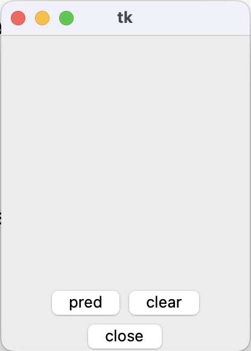
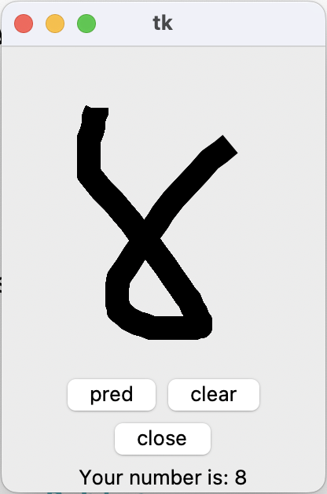
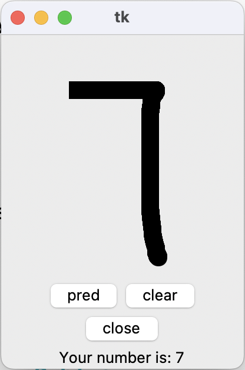
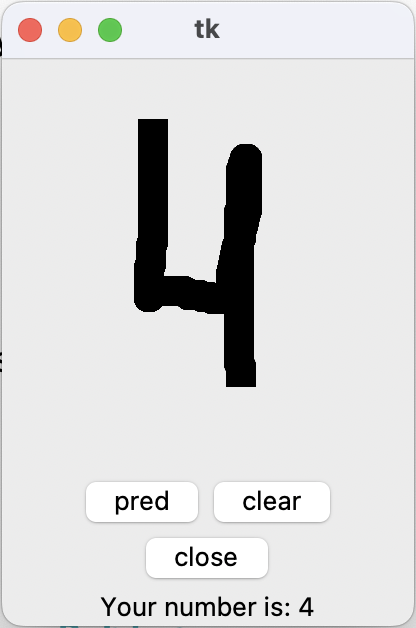

# Number Prediction
Этот проект основан на обучении нейронных сетей с помощью библиотеки PyTorch. Программа предсказывает число, которое рисует пользователь в специальном окне.

Модель обучалась и тестировалась на датасете рукописных образцов написания цифр из базы данных MNIST. Код, по которому обучалась модель, и словарь, состоящий из параметров модели, хранятся в папке model.

В проекте реализован дисплей, который состоит из окна для рисования числа

  
  
и трех кнопок:

* pred - выводит предсказание модели числа, которое нарисовал пользователь;
  
    
* clear - очищает окно рисования;
* close - закрывает программу.

# Installation
```bash
pip install -r requirements.txt
python3 main.py
```

